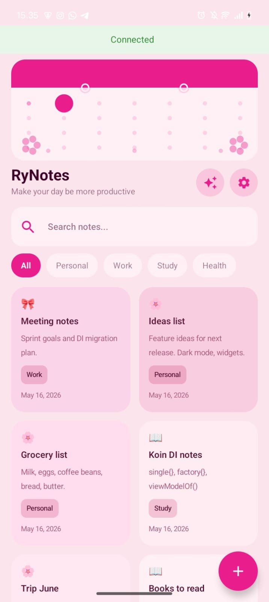

## Memory Simanjuntak
## 123140095

# RyNotes - Pengembangan Aplikasi Mobile

### AI Chat Assistant
Aplikasi ini dilengkapi fitur AI Chat yang memungkinkan pengguna 
berinteraksi dengan asisten AI untuk membantu pengelolaan catatan.

**Fitur yang tersedia:**
- Chat multi-turn dengan konteks percakapan yang terjaga
- Mendapatkan ide dan inspirasi untuk catatan
- Membuat template catatan
- Tips produktivitas

**Teknologi yang digunakan:**
- Groq API dengan model llama-3.3-70b-versatile
- Ktor Client untuk HTTP request
- Clean Architecture (Service → Repository → ViewModel → UI)

**Cara menggunakan:**
1. Buka aplikasi RyNotes
2. Tap ikon Bintang di pojok kanan atas HomeScreen atau ikon yang berada di sebelah ikon setting
3. Ketik pertanyaan atau permintaan
4. AI akan membalas dalam Bahasa Indonesia

## Screenshots
### Home Screen

### Chat Screen

### Chat Interaktif

